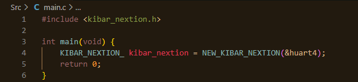
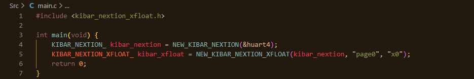
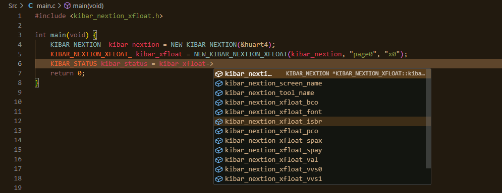

# KIBAR_STM32_NEXTION_ENHANCED_DRIVER
[EN]
It is a Nextion Enhanced, Discovery and Basic HMI driver developed to support all STM32XXXX microcontrollers and boards, based on the HAL library. It supports all Nextion HMI command sets except for specific features.

Question: How to Use Kibar Nextion HMI Driver?

If the command you are using is a Nextion tools command, you only need to include the header file related to that tool in your project. The aim here is to avoid unnecessary memory usage and prevent compilation of libraries that you do not use. If the command is a general Nextion command, it will be sufficient to include only the "kibar_nextion.h" header file.

The Kibar Nextion HMI driver, like all Kibar drivers, requires the creation of a KIBAR struct. In the Nextion HMI driver, this is referred to as KIBAR_NEXTION (The KIBAR_NEXTION structure is created with a reference to the UART peripheral unit to which it is connected.).

To create it, the NEW_KIBAR_NEXTION() function should be called as shown in the image below.

Afterwards, you should create a structure for the Nextion tool you added. The general naming convention is as follows: KIBAR_NEXTION_TOOLS_NAME_. To create this structure in memory, you should call the creation command. The general naming convention is as follows: NEW_KIBAR_NEXTION_TOOLS_NAME(KIBAR_NEXTION_, char*, char*); 

Except for the Waveform and Page structures, all structures take three parameters. These are: the previously created KIBAR_NEXTION structure, the name of the page where the tool is located, and the name of the tool. The Waveform structure additionally takes an id, while the Page structure does not take the tool name.

You can now access the properties of the structures you have created through the structure itself. Below is an example code usage:

When using the properties of the created Nextion structures, you need to provide the structure itself and the necessary values related to that structure property as parameters.

As with all KIBAR drivers, the KIBAR_NEXTION driver returns a value of type KIBAR_STATUS for all its properties. If your code isn't working, you can check the returned KIBAR_STATUS value to verify whether the Nextion structure is functioning correctly.

Question: Why am I getting "kibar_ERROR" as the return value?

You are likely encountering an error related to the UART peripheral unit or providing a value that is outside the range of valid limits for the property of the Nextion structure you are using.

Question: Why am I having problems even though I get "kibar_OK" as the return value?

Most likely, there is a connection issue between the Nextion HMI and the board. Please check your connections.

Question: How should UART be used?

You should configure the UART peripheral in asynchronous mode.

Question: The library is not visible to the compiler. What should I do?

This is a common issue and indicates that the paths to the header files are not set correctly. From the project settings, add the header file paths to the project for all configurations.

Question: Can it be used with other KIBAR libraries?

Yes, it can be easily used with other KIBAR libraries.

Question: How can I access the complete version of the library?

Contact the social media accounts listed on the GitHub profile to request the complete version of the library.

# KIBAR_STM32_NEXTION_ENHANCED_SÜRÜCÜSÜ
[TR]
HAL kütüphanesini temel alan, tüm STM32XXXX mikrodenetleyicilerini ve kartlarını desteklemek için geliştirilmiş bir Nextion ENHANCED, DISCOVERY ve BASIC HMI sürücüsüdür. Spesifik bazı özellikler dışındaki tüm Nextion HMI komut setlerini destekler.

Soru: Kibar Nextion HMI Sürücüsü Nasıl Kullanılır?

Kullandığınız komut bir Nextion aracı komutu ise projenize yalnızca o araçla ilgili başlık dosyasını eklemeniz yeterlidir. Burada amaç gereksiz hafıza kullanımının önüne geçmek ve kullanmadığınız kütüphanelerin derlenmesini önlemektir. Eğer komut genel bir Nextion komutu ise projenize sadece “kibar_nextion.h” başlık dosyasının eklenmesi yeterli olacaktır.

Tüm Kibar sürücüleri gibi Kibar Nextion HMI sürücüsü de bir KIBAR yapısının oluşturulmasını gerektirir. Nextion HMI sürücüsünde bu KIBAR_NEXTION adı ile refere edilmiştir (KIBAR_NEXTION yapısı bağlı olduğu UART çevre birimini referans alarak oluşturulur.).

Bunu oluşturmak için aşağıdaki görseldeki gibi NEW_KIBAR_NEXTION() fonksiyonunun çağrılması gerekmektedir.

Daha sonra kullanılacak Nextion aracı için aracın kendi yapısını oluşturmalısınız. Genel adlandırma kuralı şu şekildedir: KIBAR_NEXTION_TOOLS_NAME_. Bu yapıyı bellekte oluşturmak için, yaratıcı komutunu çağırmalısınız. Genel adlandırma kuralı şu şekildedir: NEW_KIBAR_NEXTION_TOOLS_NAME(KIBAR_NEXTION_, char*, char*, ..); 

Waveform ve Page yapıları dışındaki tüm yapılar üç parametre alır. Bunlar: Daha önce oluşturulan KIBAR_NEXTION yapısı, aracın bulunduğu sayfanın adı ve aracın kendi adıdır. Waveform yapısı ayrıca yapının id değerini alırken Sayfa yapısı araç adı değerini almaz.

Artık oluşturduğunuz yapıların özelliklerine yapının kendisi üzerinden erişebileceksiniz. Aşağıda örnek kod kullanımı verilmiştir:

Oluşturulan Nextion yapılarının özelliklerini kullanırken yapının kendisini ve o yapı özelliğine ilişkin gerekli değerleri parametre olarak sağlamanız gerekmektedir.

Tüm KIBAR sürücülerinde olduğu gibi, KIBAR_NEXTION sürücüsü de tüm özellikleri için KIBAR_STATUS türünde bir değer döndürür. Kodunuz çalışmıyorsa Nextion yapısının düzgün çalışıp çalışmadığını doğrulamak için döndürülen KIBAR_STATUS değerini yakalayarak kontrol edebilirsiniz.

Soru: Neden dönüş değeri olarak "kibar_ERROR" alıyorum?

Muhtemelen UART çevre birimi ile ilgili bir hatayla karşılaşıyorsunuz veya kullandığınız Nextion yapısının özelliği için geçerli limit aralığının dışında bir değer sağlıyorsunuz.

Soru: Dönüş değeri olarak "kibar_OK" alıyorum ancak neden hala sorun yaşıyorum?

Büyük olasılıkla Nextion HMI ile kart arasında bir bağlantı sorunu var. Lütfen bağlantılarınızı kontrol edin.

Soru: UART birimi hangi ayarlar ile kullanılmalı?

Soru: Diğer KIBAR kütüphaneleri ile kullanılabilir mi?

UART çevre birimini asenkronize modda yapılandırmanız gerekir.

Soru: Kütüphane derleyici tarafından görülemiyor. Ne yapmalıyım?

Bu yaygın bir sorundur ve başlık dosyalarına giden yolların doğru şekilde ayarlanmadığını gösterir. Proje ayarlarından tüm konfigürasyonlar için başlık dosyalarının yolunu projeye ekleyin.

Soru: Diğer KIBAR kütüphaneleri ile kullanılabilir mi?

Evet diğer KIBAR kütüphaneleri ile rahatlıkla kullanılabilir.

Soru: Kütüphanenin tam sürümüne nasıl erişebilirim?

Kütüphanenin tam sürümünü talep etmek için GitHub profilinde listelenen sosyal medya hesaplarıyla iletişime geçin.
